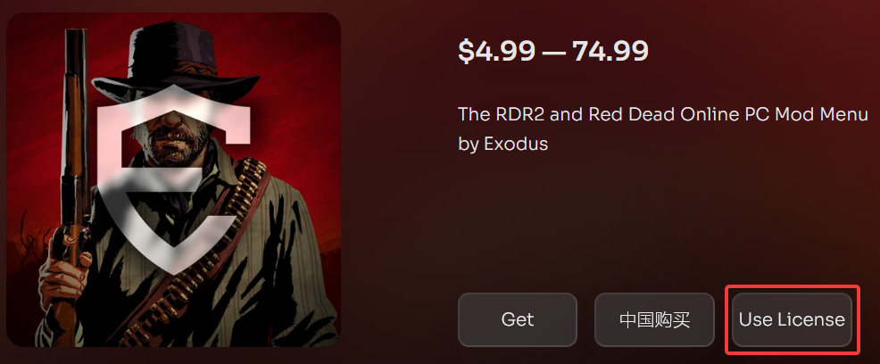
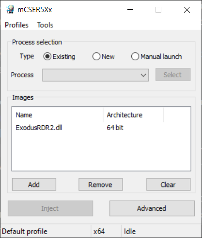
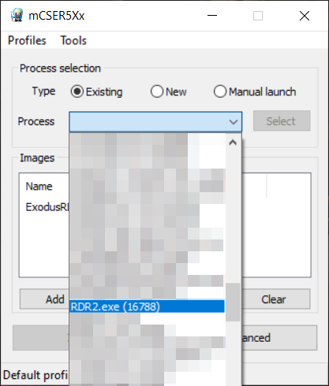
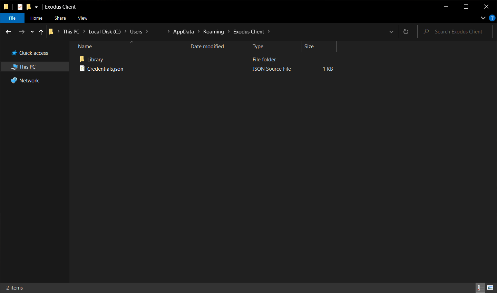
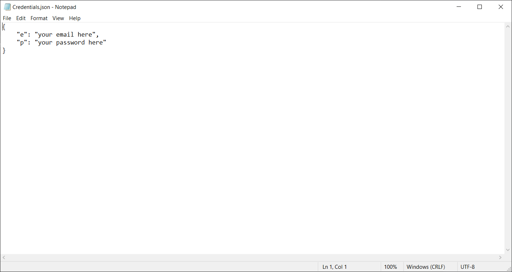
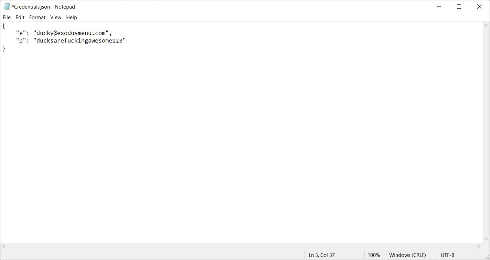

### [Home](../index.md) / Getting Started
---
## Getting started with Exodus RDR2
1. Make sure you have [redeemed your license](#how-and-where-do-i-redeem-my-license).
    1. Go to the [Exodus Store](https://exodusmenu.com/store).
    2. Press on either [Red Dead Online Mod Menu](https://exodusmenu.com/store/red-dead-online/rdr-online-mod-menu/view) or [Red Dead Online Mod Menu Lite](https://exodusmenu.com/store/red-dead-online/rdr-online-mod-menu-lite/view).
    3. Press `Use License` and redeem your license.
    
2. Disable any Anti-Virus software including Windows Defender temporarily.
3. Download [Xenos Injector](https://github.com/DarthTon/Xenos) from the [official GitHub repository](https://github.com/DarthTon/Xenos/releases/download/2.3.2/Xenos_2.3.2.7z) & this product from [your Exodus library](https://exodusmenu.com/account/library).
4. Extract Xenos from `Xenos_2.3.2.7z` using a free file archiver like [7-Zip](https://www.7-zip.org/download.html) or [WinRAR](https://www.rarlab.com/download.htm).
5. Add an exclusion for the Xenos folder/Xenos64.exe and the Exodus DLL to [Windows Security](https://support.microsoft.com/en-us/windows/add-an-exclusion-to-windows-security-811816c0-4dfd-af4a-47e4-c301afe13b26) or other Anti-Virus software.
6. Open the 64-bit Xenos injector (`Xenos64.exe`) and add the downloaded Exodus DLL to it.

7. Start Red Dead Redemption 2.
8. Select Freemode in the Online Main Menu.
9. After 10 seconds, select `RDR2.exe` as process in the Xenos Injector and click Inject.

10. Wait until a console window opens asking you to enter your account information in "Credentials.json".

11. The client folder should be opened automatically, if not, either go to `C:\Users\YourUser\AppData\Roaming\Exodus Client` or press `win + r` and enter `AppData\Roaming\Exodus Client`.

12. Open `Credentials.json` with Notepad or a text editor of your choice and fill in your account information:
```json
{
    "e": "youremail@email.com",
    "p": "yourpassword"
}
```

Replace `youremail@email.com` with the email address you used to sign up to Exodus and `yourpassword` with your Exodus password.

13. Save the changes you just made by pressing `Ctrl+S`.
14. Done. All you have to do now is inject again.
